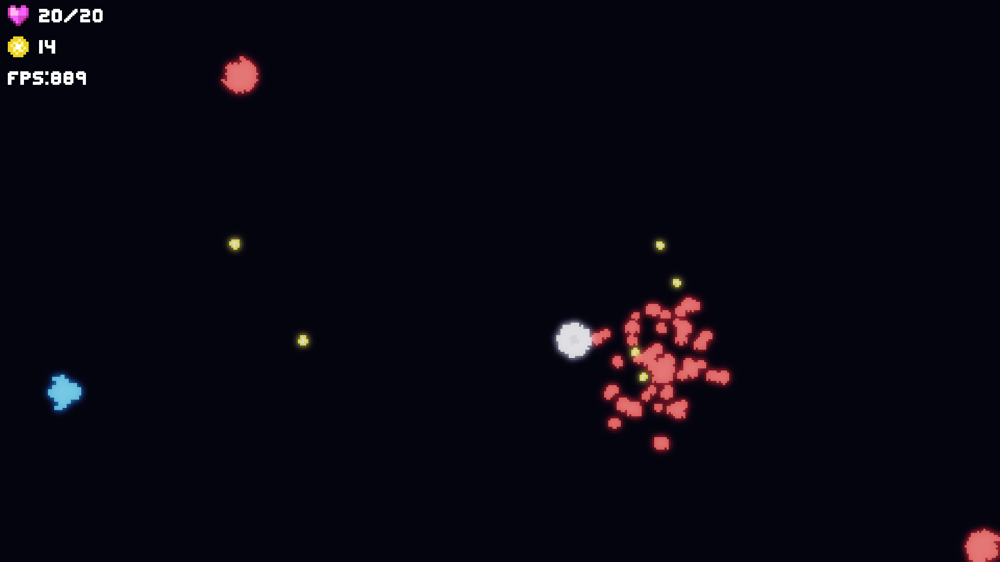
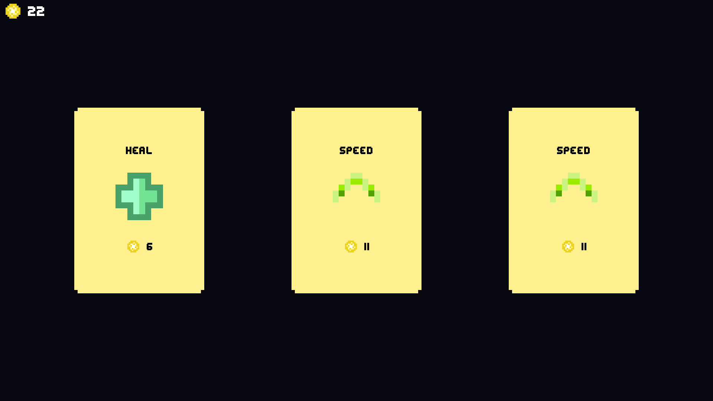
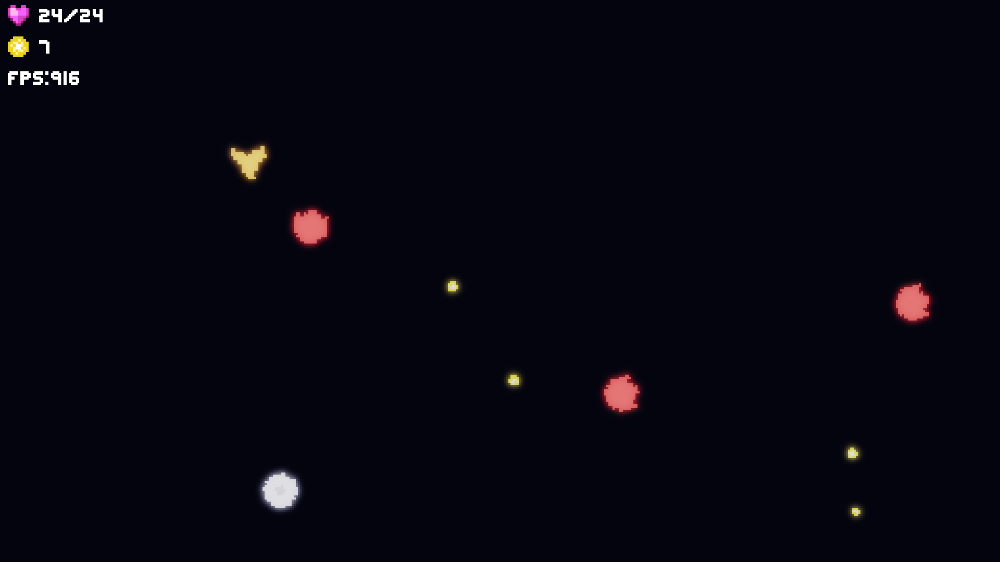
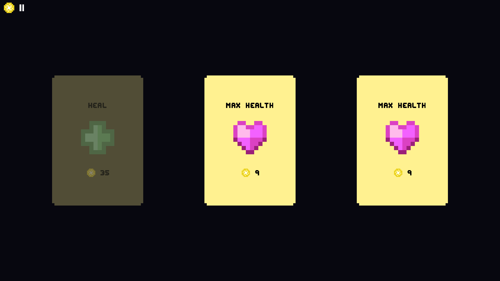
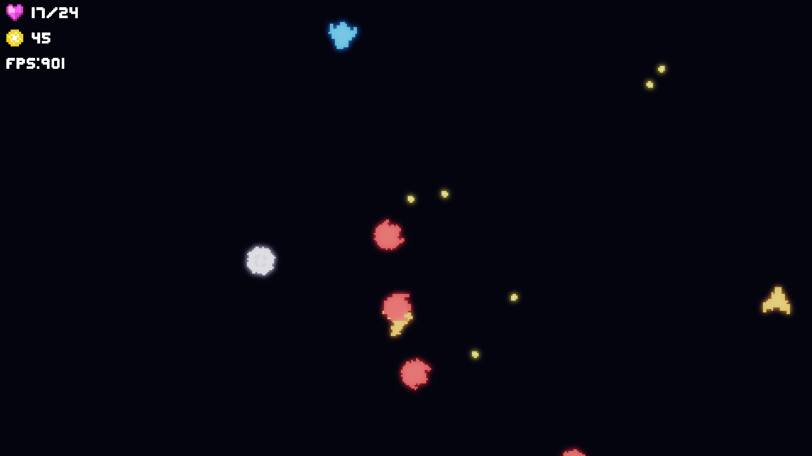

# Spectrum

A game about shooting multicolored enemies

## Controls

WASD - Move around

Left Mouse Button - Fire your Gun

Tab - Open Shop to Upgrade Yourself!

F11 - Fullscreen (Broken On Linux)

Esc - Pause

## Gameplay

Shoot Enemies, Collect Light, Upgrade in the Shop, Rinse and Repeat

## Images

## Building

- Run `git clone https://github.com/FearlessOne07/Spectrum.git --recursive`
- Make sure cmake and your desired generator are installed
- Run `cmake -S . -B build` to generate build files in the `build` directory
- Run `cmake --build build` to build the executable and libraries.
- Executable will be in the `bin` directory
- Run the executable from the `Spectrum` directory to play
  
## Credits

The "heart-ui" and "power-ups" textures are modified versions of these [assets](https://gvituri.itch.io/space-shooter)
